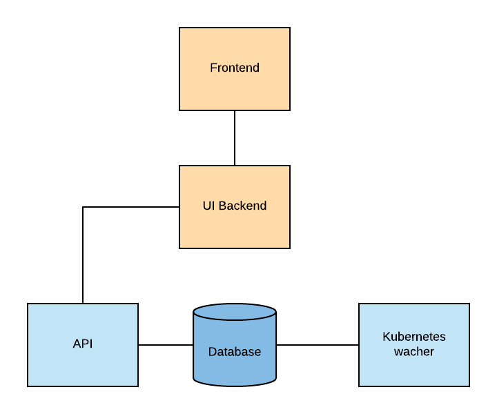

# Architecture

StatusBay project consists for components. 

## UI 

- Written in [React](https://reactjs.org/).
- Using [React Material](https://material-ui.com/) for UI components.
- Every API request goes to UI backend.

## UI Webserver

- Writing in Node.js.
- The component build to communicate between the API and the UI.

## API

- Writing in [Golang](https://golang.org/).
- The API components communicate with Database **(Read-Only access)**
- See list of available API [endpoints](api-endpoints.md)

## watcher

- Writing in [Golang](https://golang.org/).
- Registers and watches to resource changes (CREATE/UPDATE/DELETE) in K8S clusters, collect the information and save the result to Database. 

