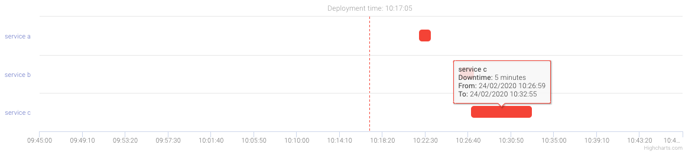

# StatusCake
This integration makes the following assumptions: 

* You have an active account in StatusCake
* You have a dedicated User and Token for StatusBay to use StatusCake's API.
* You are using tags for all your alerts in StatusCake
  
StatusBay introduces the ability to show StatusCake alerts for a specific service running on Kubernetes. 

By default we show the graphs with a red dotted line marker ,which resembles the current time of the operator's deployment,we want the ability to see what happened 30 minutes before and 30 minutes after the deployment.  

On operator of a service in Kubernetes will have ability to see alerts graph in StatusBay's UI based on StatusCake tags.

## How to enable this provider?

In order to enable this provider please proceed with the next steps:

* Configure StatusCake provider via StatusBay [API configuration file](../../../examples/configuration/api.yaml#L21), you will find all the available configuration options in the example file.
* Add the [Available annotations](#available-annotations) for this provider

## Available annotations
| Name | Type | Associated Annotations | 
| ---- | ---- | ---------------------- | 
| StatusCake | Endpoints Alerts | `statusbay.io/alerts-statuscake: tag1,tag2` |

* Make sure you add these annotations to your applications.
* The annotations support comma separated list of tags of Alerts which we want to display. 

## The result

