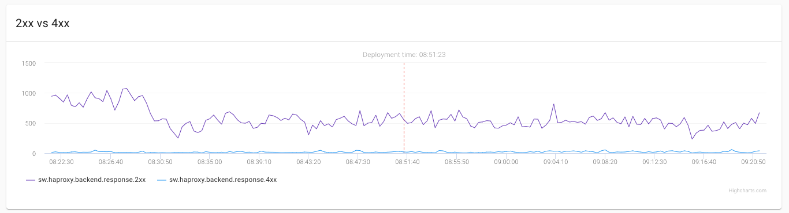

# Prometheus
This integration makes the following assumptions: 

* You have an active installation of Prometheus in your Kubernetes Cluster.
  
StatusBay introduces the ability to show Prometheus graphs for a specific service running on Kubernetes.

By default we show the graphs with a red dotted line marker ,which resembles the current time of the operator's deployment,we want the ability to see what happened 30 minutes before and 30 minutes after the deployment.  

On operator of a service in Kubernetes will have ability to see Datadog graph in StatusBay's UI based on Prometheus query.

## How to enable this provider?

In order to enable this provider please proceed with the next steps:

* Configure Prometheus provider via StatusBay [API configuration file](../../../examples/configuration/api.yaml#L19), you will find all the available configuration options in the example file.
* Add the [Available annotations](#available-annotations) for this provider

## Available annotations
| Name | Type | Associated Annotations | 
| ---- | ---- | ---------------------- | 
| Prometheus | Metrics | `statusbay.io/metrics-prometheus-<Metric-Name>: prometheus-query` |

* Make sure you add these annotations to your applications.
* The aforementioned annotation will need following: 
  * `<Metric-Name>` - Will be the name displayed the name of the graph
  * `prometheus-query` - Prometheus query to get the graph
  
## The result

* In the example above here are the comparison for the following
  * `<Metric-Name>` -> `Total Requests`
  * `prometheus-query` -> `prometheus_http_requests_total`